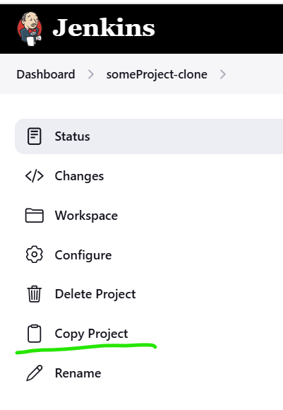

This plugin adds the "Copy project" link into left side panel in the main project page to facilitate copying of job configuration.

----
## Support

“Open source” does not mean “includes free support”

You can support the contributor and buy him a coffee.
 
Every second invested in an open-source project is a second you can't invest in your own family / friends / hobby.
That`s the reason, why supporting the contributors is so important.

Thx very much for supporting us.

----

## Report an Issue

Please report issues and enhancements through the [Jenkins issue tracker in GitHub](https://github.com/jenkinsci/copy-project-link-plugin/issues/new/choose)

----

## Contributing

Contributions are welcome, please
refer to the separate [CONTRIBUTING](CONTRIBUTING.md) document
for details on how to proceed!

----

## License

All source code is licensed under the MIT license.
See [LICENSE](LICENSE.txt)